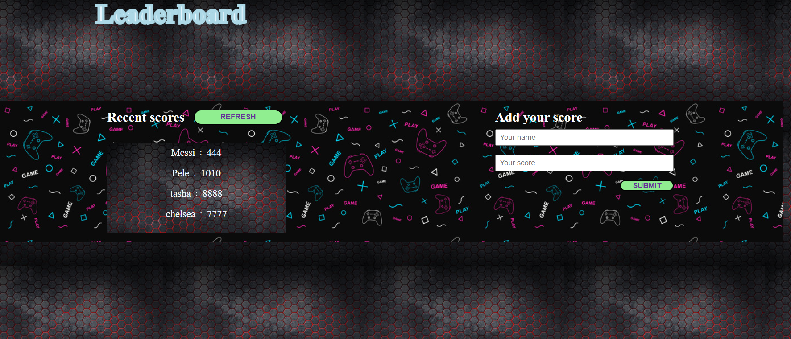

# Leaderboard
Hello everyone, in this project I will be building a leaderboard app with webpack.
# DESCRIPTION
In this project, when the user enters the name and the scores it appears dynamically on the UI. Webpack will bundle the html, css and javascript file.

## Built With

- HTML
- CSS
- JAVASCRIPT
- VSCODE
- Webpack

## Image Preview

## Live Demo

[Live Demo Link](https://vermillion-mooncake-0a3677.netlify.app/)

# Prerequisite
* Modern Browser.Example: Firefox, chrome.
* Windows 7 and above, MacOs, linux and android.

# INSTALLATIONS
* webpack

# SET UP
* Clone this repo : https://github.com/aneallaryea100/Leaderboard.git
* Run npm install if you don't have node.js installed it on your computer.
* Run npm run build and npm start in your terminal to get the project running.

# AUTHOR
👤 Aneal Laryea
* Github: [@aneallaryea](https://github.com/aneallaryea100)
* LinkdIn: [@aneallaryea](https://www.linkedin.com/in/nii-aneal-84ba7a147)
* Twitter: [@aneallaryea](https://twitter.com/AnealLaryea)

## 🤝 Contributing

Contributions, issues, and feature requests are welcome!

Feel free to check the [issues page](../../issues/).

## Show your support

Give a ⭐️ if you like this project!

## Acknowledgments

- This is a microverse project to help students implement ES6 syntax and be more familiar with dynamic javascript with webpack.

## 📝 License

This project is MIT.md licensed.
